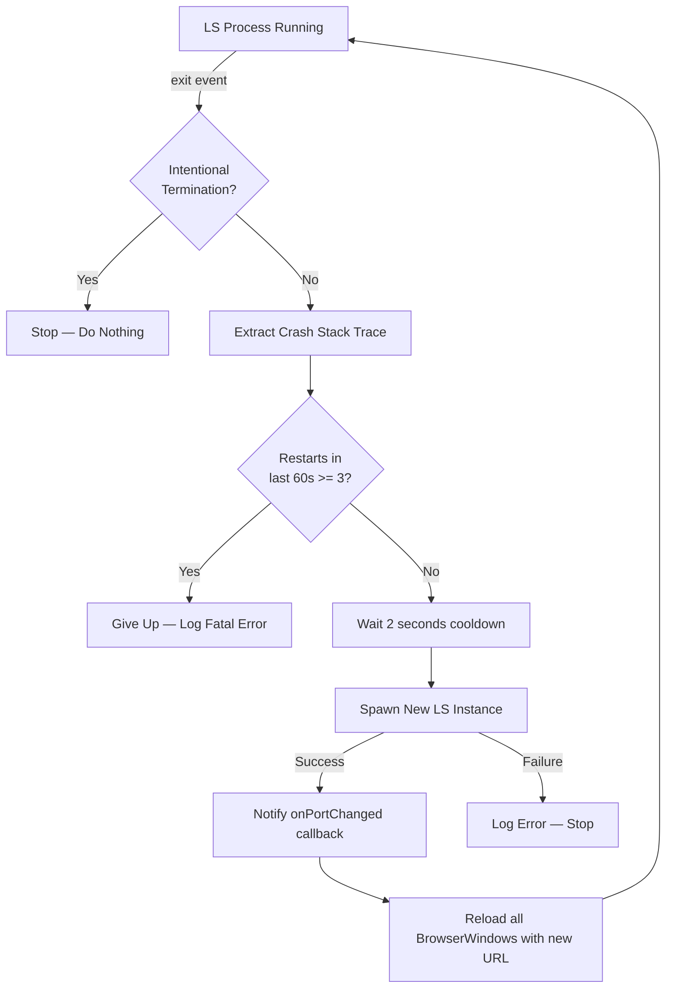
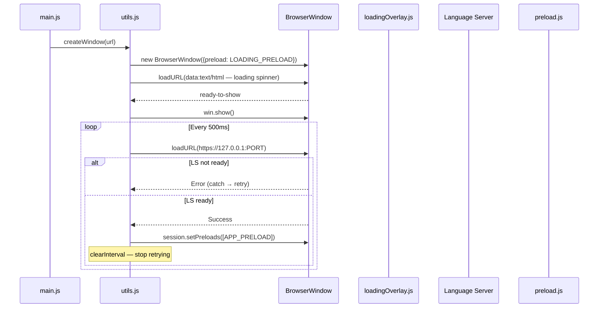
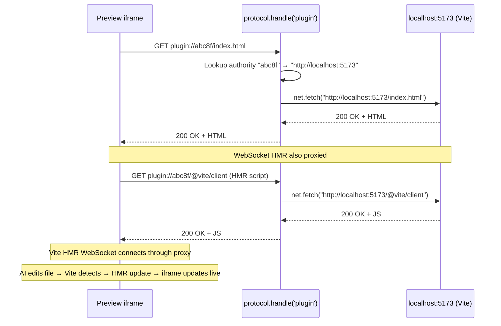
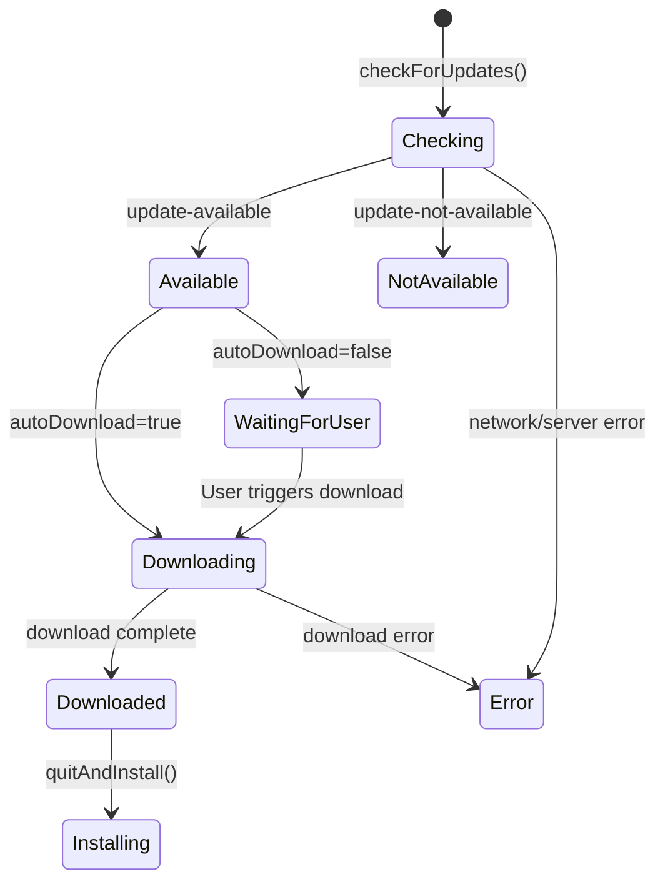
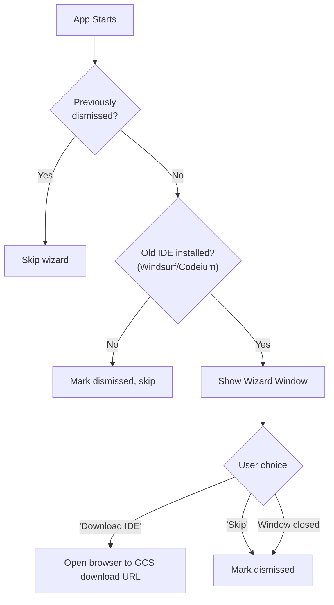
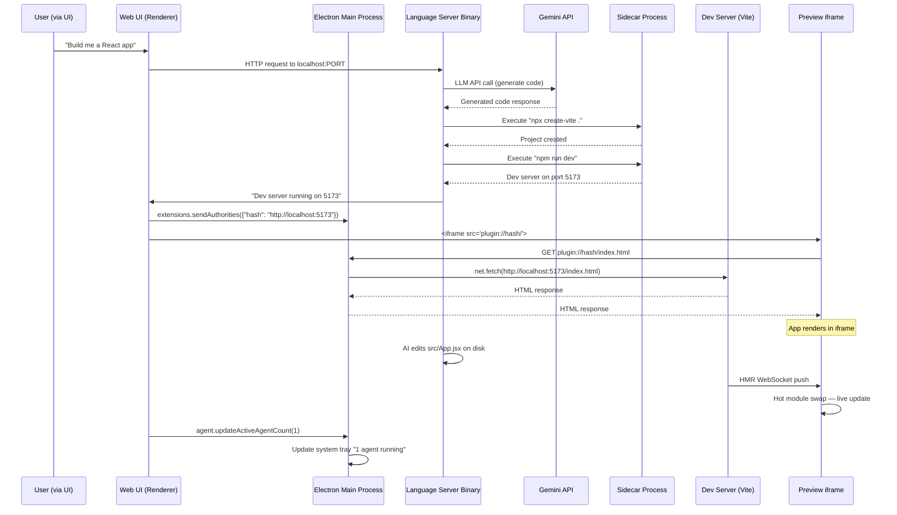

# Antigravity Desktop Application — Technical Architecture Report

> **Product**: Antigravity v2.3.1 — Agentic Desktop Application  
> **Publisher**: Google (`antigravity-support@google.com`)  
> **Codebase Scope**: Compiled Electron main process (`dist/`) — the native desktop shell  
> **Date**: July 2026

---

## 1. Executive Summary

Antigravity is an **agent-first AI desktop application** built on Electron. It is **not** a traditional code editor — it is a native desktop shell whose sole purpose is to:

1. **Spawn and babysit** a standalone backend binary called the **Language Server (LS)** — the core AI brain.
2. **Display the LS-served web UI** inside a frameless Chromium window.
3. **Bridge native OS capabilities** (file system, notifications, system tray, deep links, auto-updates) to the web UI via IPC.
4. **Proxy live preview traffic** for AI-generated applications through a custom `plugin://` protocol scheme.

The actual AI agent logic, LLM orchestration, and code generation happen entirely inside the compiled `language_server` binary. The Electron shell is a **lifecycle manager, crash watchdog, and native API bridge**.

---

## 2. High-Level Architecture

```mermaid
graph TB
    subgraph "Operating System"
        SysTray["System Tray Icon"]
        Notifications["OS Notifications"]
        FileSystem["File System"]
        DeepLinks["Deep Links (antigravity://)"]
    end

    subgraph "Electron Main Process"
        Main["main.js — App Lifecycle"]
        LS["languageServer.js — LS Orchestrator"]
        IPC["ipcHandlers.js — IPC Bridge"]
        Tray["tray.js — System Tray"]
        Updater["updater.js — Auto-Updater"]
        Storage["storage.js — JSON State Store"]
        Settings["settingsService.js — User Prefs"]
        Utils["utils.js — Window Factory"]
        CustomScheme["customScheme.js — plugin:// Proxy"]
        Preload["preload.js — Context Bridge"]
        Menu["menu.js — App Menu"]
        Paths["paths.js — Path Resolution"]
        IDE["ideInstall/ — IDE Migration Wizard"]
    end

    subgraph "Language Server Binary"
        LSBin["language_server (Go/Rust binary)"]
        AILoop["AI Agent Loop"]
        MCP["MCP Server Runtime"]
        Sidecars["Sidecar Processes"]
        WebUI["Served Web UI (HTTPS)"]
    end

    subgraph "Electron Renderer (BrowserWindow)"
        UI["Language Server Web UI"]
        Iframe["Live Preview iframe (plugin://)"]
    end

    subgraph "External Services"
        Gemini["generativelanguage.googleapis.com"]
        CloudCode["daily-cloudcode-pa.googleapis.com"]
        GCS["storage.googleapis.com (IDE downloads)"]
    end

    Main --> LS
    Main --> IPC
    Main --> Tray
    Main --> Updater
    Main --> Utils
    Main --> Menu
    Main --> IDE
    Main --> CustomScheme

    LS -->|"spawn + monitor"| LSBin
    LSBin --> AILoop
    LSBin --> MCP
    LSBin --> Sidecars
    LSBin -->|"serves HTTPS on dynamic port"| WebUI
    AILoop -->|"API calls"| Gemini
    AILoop -->|"API calls"| CloudCode

    Utils -->|"loadURL(https://127.0.0.1:PORT)"| UI
    Preload -->|"contextBridge.exposeInMainWorld"| UI
    UI -->|"IPC invoke"| IPC
    IPC -->|"native APIs"| SysTray
    IPC -->|"native APIs"| Notifications
    IPC -->|"native APIs"| FileSystem

    UI -->|"extensions:send-authorities"| CustomScheme
    CustomScheme -->|"net.fetch proxy"| Iframe
    Iframe -->|"plugin://authority/path"| CustomScheme

    Tray --> SysTray
    DeepLinks --> Main
    Updater -->|"download from"| GCS
    Storage --> FileSystem
```



---

## 3. File-by-File Breakdown

### 3.1 Core Application Lifecycle

#### [main.js](file:///home/lenovo/Downloads/antireference/dist/main.js) — Entry Point (368 lines)

The orchestrator of the entire application. Responsibilities:

| Responsibility | Detail |
|---|---|
| **Single Instance Lock** | Uses `app.requestSingleInstanceLock()`. If another instance is already running, immediately quits. |
| **Headless Mode** | Detected via `ELECTRON_OZONE_PLATFORM_HINT=headless`. Disables GPU, sandbox, and GTK; skips window creation; pipes `stdin` directly to the LS for terminal-based interaction. |
| **Deep Link Protocol** | Registers `antigravity://` as a custom protocol. Handles deep links on launch (from `process.argv`) and at runtime (via `open-url` and `second-instance` events). |
| **Startup Sequence** | On `app.whenReady()`: initializes logging → creates `StorageManager` → registers IPC handlers → shows IDE migration wizard → validates LS binary exists → generates CSRF token → spawns LS → creates window → creates tray → starts auto-updater. |
| **Graceful Shutdown** | On `before-quit`: optionally shows a confirmation dialog ("There may be agents or background tasks running"), destroys all windows, closes all HTTP sessions, kills the LS, then quits. |
| **macOS Background Mode** | On `window-all-closed`: if `RUN_IN_BACKGROUND` setting is enabled, hides the dock icon and keeps the LS running. Otherwise, quits. |

**Critical State Variables:**
```javascript
let storageManager;              // Persistent JSON store
let settingsService;             // User preferences accessor
let hasStartedMainApplication;   // Guards premature quit
let isQuitting;                  // Prevents re-entrant quit logic
let pendingDeepLink;             // Queued URL before windows exist
```

---

#### [constants.js](file:///home/lenovo/Downloads/antireference/dist/constants.js) — Global Constants (7 lines)

```javascript
DYNAMIC_PORT = 0;                   // Tells the LS to pick a free port
WINDOW_ORIGIN = 'https://127.0.0.1' // Base URL for the LS web UI
```

> [!IMPORTANT]
> The app connects to the Language Server over **HTTPS on localhost**, not HTTP. This is significant — it means the LS generates a self-signed TLS certificate, and the Electron shell must explicitly trust it (see `setupLocalCertTrust`).

---

### 3.2 Language Server Orchestration

#### [languageServer.js](file:///home/lenovo/Downloads/antireference/dist/languageServer.js) — LS Lifecycle Manager (424 lines)

This is the most critical file. It manages the full lifecycle of the AI backend binary.

##### 3.2.1 Binary Resolution

```javascript
const binName = isWindows ? 'language_server.exe' : 'language_server';
LS_BINARY = app.isPackaged
    ? path.join(process.resourcesPath, 'bin', binName)          // Production
    : process.env.CODEIUM_LANGUAGE_SERVER_BIN ||                 // Dev override
      path.join(__dirname, '..', 'bin', binName);                // Dev default
```

The LS binary is expected at `<app>/resources/bin/language_server` in production. In development, it can be overridden via the `CODEIUM_LANGUAGE_SERVER_BIN` environment variable.

##### 3.2.2 Spawning the Language Server

The `startLanguageServer(port, csrf, headless)` function:

1. **Opens a log file** at `~/.gemini/antigravity/ls.log` (write-mode, truncates previous).
2. **Constructs CLI arguments**:
   ```
   --standalone
   --override_ide_name antigravity
   --subclient_type hub
   --override_ide_version <electron_version>
   --override_user_agent_name antigravity
   --https_server_port <port>
   --csrf_token <uuid>
   --app_data_dir .gemini
   --api_server_url https://generativelanguage.googleapis.com
   --cloud_code_endpoint https://daily-cloudcode-pa.googleapis.com
   --enable_sidecars
   ```
3. **Resolves the shell environment** via `shell-env` (because Electron apps don't inherit `$PATH` from the user's shell when launched from a GUI).
4. **Sets up the Node.js wrapper** so the LS can execute Node.js via the bundled Electron binary (for MCP servers and sidecars).
5. **Provisions MCP modules** by setting `CHROME_DEVTOOLS_MCP_JS` to the path of the bundled `chrome-devtools-mcp` package.
6. **Spawns** the binary with `child_process.spawn()` using `stdio: ['pipe', 'pipe', 'pipe']`.
7. **Monitors stdout/stderr** via a combined `PassThrough` stream, scanning each line for the port announcement pattern:
   ```
   /listening on \w+ port at (\d+) for HTTP(S)?\b/i
   ```
8. **Resolves the promise** with a `LanguageServerHandle` containing `{ port, process, exitPromise }`.
9. **Times out** after 60 seconds if no port is announced.

##### 3.2.3 Crash Monitoring and Auto-Restart



**Crash detection** scans a ring buffer of the last 100KB of stderr for trigger phrases:
- `panic:` / `fatal error:` / `unexpected fault address` / `runtime:` — typical Go runtime panics
- `running GoogleExitFunction` / `panic serving` — application-level crashes

**Restart constraints:**
| Parameter | Value |
|---|---|
| Max restarts in window | 3 |
| Restart window | 60 seconds |
| Cooldown between restarts | 2 seconds |
| Stderr buffer size | 100,000 chars (ring buffer) |

##### 3.2.4 Graceful Shutdown

```javascript
async function killLanguageServer() {
    setIntentionalTermination(true);   // Suppress crash handler
    proc.kill('SIGTERM');              // Polite shutdown
    // Wait up to 5 seconds...
    if (timeout) {
        process.kill(pid, 'SIGKILL'); // Force kill
    }
    clearLsProcess();
}
```

##### 3.2.5 Local Certificate Trust

```javascript
function setupLocalCertTrust() {
    session.defaultSession.setCertificateVerifyProc((request, callback) => {
        if (request.hostname === '127.0.0.1' || request.hostname === 'localhost') {
            callback(0);  // Accept self-signed cert
        } else {
            callback(-3); // Default OS validation
        }
    });
}
```

This is called every time the LS restarts (and potentially changes its self-signed cert), ensuring the Electron window can load `https://127.0.0.1:<port>` without certificate errors.

---

### 3.3 Window Management

#### [utils.js](file:///home/lenovo/Downloads/antireference/dist/utils.js) — Window Factory (175 lines)

##### 3.3.1 Window Creation Flow



**Key Window Options:**
```javascript
{
    width: 1280, height: 820,
    minWidth: 420, minHeight: 310,
    titleBarStyle: 'hiddenInset' (Mac) / 'hidden' (Win/Linux),
    titleBarOverlay: { color: '#191919', symbolColor: '#c5c5c5' },  // Windows only
    webPreferences: {
        nodeIntegration: false,
        contextIsolation: true,
        webviewTag: true,          // Enables <webview> tags in the renderer
    },
    backgroundColor: '#191919',    // Dark background to prevent flash
    show: false,                   // Hidden until ready-to-show
}
```

##### 3.3.2 Navigation Interception

External HTTP/HTTPS links are opened in the system browser via `shell.openExternal()`. Localhost URLs (from the LS) are allowed to open in new Electron windows with the full `APP_PRELOAD`.

##### 3.3.3 The Embedded Node.js Wrapper

```javascript
function setupNodeWrapper(env) {
    env['JETSKI_NODE_WRAPPER_SCRIPT'] = wrapperScript;  // node_wrapper.sh or .bat
    env['JETSKI_NODE_PATH'] = process.execPath;          // Electron's bundled Node
}
```

> [!IMPORTANT]
> This is how the AI backend runs Node.js without requiring the user to have Node installed. The LS replaces `node` in its `$PATH` with a symlink to a wrapper script that redirects to Electron's embedded Node binary. This allows MCP servers and sidecar processes to execute JavaScript seamlessly.

---

#### [loadingOverlay.js](file:///home/lenovo/Downloads/antireference/dist/loadingOverlay.js) — Loading Spinner (60 lines)

A self-contained HTML string rendered as a `data:` URL. Shows a minimal CSS spinner on a `#191919` background with `-webkit-app-region: drag` so the user can drag the frameless window while waiting.

---

#### [keybindings.js](file:///home/lenovo/Downloads/antireference/dist/keybindings.js) — Keyboard Shortcuts (15 lines)

Registers `Cmd/Ctrl+Shift+N` to create a new window (intercepted via `before-input-event` to override default browser behavior).

---

#### [menu.js](file:///home/lenovo/Downloads/antireference/dist/menu.js) — Application Menu (55 lines)

Platform-aware native menu with standard Edit, View (reload, DevTools, zoom), and Window submenus. macOS gets the additional About / Services / Hide / Quit app menu.

---

### 3.4 The IPC Bridge — Native API Surface

#### [preload.js](file:///home/lenovo/Downloads/antireference/dist/preload.js) — Context Bridge (108 lines)

Exposes **11 API namespaces** to the web UI via `contextBridge.exposeInMainWorld`:

| Global Object | Methods | Purpose |
|---|---|---|
| `window.storage` | `getItems()`, `updateItems(changes)` | Persistent key-value store |
| `window.dialog` | `openWorkspace()` | Native directory picker |
| `window.updater` | `apply()`, `quitAndInstall()`, `onStateChange(cb)`, `getState()`, `checkForUpdates()` | Auto-update control |
| `window.notification` | `send(options)`, `onClicked(cb)`, `openSystemPreferences()` | OS notifications |
| `window.logs` | `getElectronLogs()` | Retrieve Electron log file contents |
| `window.extensions` | `sendAuthorities(map)` | Register `plugin://` scheme mappings |
| `window.agent` | `updateActiveAgentCount(n)` | Report running agent count to tray |
| `window.windowControls` | `minimize()`, `maximize()`, `unmaximize()`, `isMaximized()`, `close()`, `toggleDevTools()`, `setTitleBarOverlay()`, `onMaximizedChange(cb)` | Custom title bar controls |
| `window.shell` | `openExternal(url)`, `revealInFilePicker(path)` | Open URLs / reveal files |
| `window.deepLink` | `onDeepLink(cb)`, `getStoredDeepLink()` | Deep link handling |
| `window.ide` | `isInstalled()` | Check if Antigravity IDE exists |

#### [ipcHandlers.js](file:///home/lenovo/Downloads/antireference/dist/ipcHandlers.js) — Main Process Handlers (230 lines)

Registers the corresponding `ipcMain.handle()` listeners for every preload API. Notable implementations:

- **`shell:open-external`**: Sanitizes URLs — only allows `https://`, `http://`, and `antigravity-ide://` protocols.
- **`notification:open-system-preferences`**: Cross-platform notification settings (macOS: `x-apple.systempreferences:`, Windows: `ms-settings:notifications`, Linux: tries GNOME/KDE/XFCE in sequence).
- **`window:set-title-bar-overlay`**: Windows-only API to dynamically change the title bar colors (for dark/light theme switching).

---

### 3.5 Live Preview — The `plugin://` Custom Scheme Proxy

#### [customScheme.js](file:///home/lenovo/Downloads/antireference/dist/customScheme.js) — Protocol Proxy (56 lines)

This is the mechanism that enables **simultaneous live code editing and preview**.

##### 3.5.1 Registration (Before App Ready)

```javascript
protocol.registerSchemesAsPrivileged([{
    scheme: 'plugin',
    privileges: {
        standard: true,            // URL parsing like http://
        secure: true,              // Treated as HTTPS (enables crypto, service workers)
        supportFetchAPI: true,     // fetch() works inside iframes using this scheme
        corsEnabled: true,         // No CORS blocking
        allowServiceWorkers: true, // Vite/Next.js service workers work
        codeCache: true,           // V8 bytecode caching for performance
    },
}]);
```

> [!CAUTION]
> `registerSchemesAsPrivileged` **must** be called before the `app.ready` event. It cannot be called later. This is an Electron hard requirement.

##### 3.5.2 Authority Mapping (Runtime)

The web UI calls `window.extensions.sendAuthorities({ "abc8f": "http://localhost:5173" })` via IPC. This populates a `Map<string, string>` in the main process that maps hashed authority identifiers to local dev server URLs.

##### 3.5.3 Request Interception and Proxying



**Key technical detail — `duplex: 'half'`:**
```javascript
if (request.body) {
    fetchOptions.duplex = 'half';  // Required for streaming request bodies
}
```
Without this flag, Electron's `net.fetch` will throw when proxying requests with streaming bodies (POST requests, WebSocket upgrades).

##### 3.5.4 The Complete Live Edit Loop

```mermaid
flowchart LR
    A["AI Agent generates code"] -->|"writes to filesystem"| B["File System"]
    B -->|"fs.watch / chokidar"| C["Dev Server (Vite/Webpack)"]
    C -->|"HMR WebSocket push"| D["Preview iframe (plugin://)"]
    D -->|"Hot module swap"| E["Updated UI visible instantly"]

    F["User sees changes in real-time"] --> G["AI sees preview via Chrome DevTools MCP"]
    G -->|"screenshot / DOM inspection"| A
```



---

### 3.6 System Tray & Agent Tracking

#### [tray.js](file:///home/lenovo/Downloads/antireference/dist/tray.js) — System Tray (78 lines)

Creates a system tray icon with a context menu:
- **Agent counter**: "No agents running" / "3 agents running"
- **Open Antigravity**: Shows or creates a window
- **Quit**: Triggers graceful shutdown

The agent count is updated by the web UI calling `window.agent.updateActiveAgentCount(n)`, which triggers `updateTrayAgentCount` in the main process.

**macOS template images**: Uses `trayTemplate.png` / `trayTemplate@2x.png` for automatic dark/light mode adaptation.

---

### 3.7 Persistent Storage

#### [storage.js](file:///home/lenovo/Downloads/antireference/dist/storage.js) — JSON File Store (85 lines)

A simple key-value store backed by `~/.gemini/antigravity/state.json`.

| Method | Behavior |
|---|---|
| `getItems()` | Returns `{...defaults, ...data}` (defaults merged with saved data) |
| `getItem(key)` | Returns saved value, falling back to default |
| `updateItems(changes)` | Merges changes, deletes `null`/`undefined` keys, writes to disk |

#### [settingsService.js](file:///home/lenovo/Downloads/antireference/dist/services/settingsService.js) — Settings Accessor (30 lines)

Wraps `StorageManager` with typed setting keys:

| Key | Default | Purpose |
|---|---|---|
| `settings.autoUpdate` | `true` | Automatically download and install updates |
| `settings.runInBackground` | `false` | Keep LS alive when all windows are closed |

---

### 3.8 Auto-Updater

#### [updater.js](file:///home/lenovo/Downloads/antireference/dist/updater.js) — Update Manager (100 lines)

Uses `electron-updater` (`autoUpdater`) for OTA updates.



**Behavior:**
- Auto-checks on startup + every 60 minutes.
- If `settings.autoUpdate` is `true`, downloads automatically. Otherwise waits for user action.
- In headless mode, logs that the update will install on next restart.
- State changes are broadcast to all open windows via `webContents.send('updater:state-change', state)`.

---

### 3.9 IDE Migration Wizard

#### [ideInstall/](file:///home/lenovo/Downloads/antireference/dist/ideInstall/) — Migration Flow (6 files)

Handles the transition from the old "Windsurf" / "Codeium" IDE to the new agent-first "Antigravity" app.



**Old IDE detection** checks platform-specific paths:
- **macOS**: `/Applications/Windsurf.app`, `/Applications/Codeium.app`
- **Linux**: `/opt/Windsurf/windsurf`, `/opt/windsurf/windsurf`, etc.
- **Windows**: `%LOCALAPPDATA%\Programs\Windsurf\Windsurf.exe`, etc.

**Download URLs** are constructed from `https://storage.googleapis.com/antigravity-ide/<version>/<filename>` with platform-specific filenames (`.dmg`, `.deb`, `.exe`).

---

### 3.10 Path Resolution

#### [paths.js](file:///home/lenovo/Downloads/antireference/dist/paths.js) — Path Helpers (30 lines)

| Function | Returns |
|---|---|
| `getAppDataDirName()` | `.gemini` (production) or `.gemini-dev` (development) |
| `getAppStoragePath()` | `~/.gemini/antigravity/` |
| `getLsLogPath()` | `~/.gemini/antigravity/ls.log` |
| `getActivePortFilePath()` | `~/.gemini/antigravity/active_port` |

> [!NOTE]
> The `active_port` file is written by the LS and read by the browser recording encoder. The Electron shell sets the env var `AGY_BROWSER_ACTIVE_PORT_FILE` so the LS knows where to write it, but does not read the file itself to avoid adding startup latency.

---

## 4. Complete Application Lifecycle Flowchart

```mermaid
flowchart TD
    Start(["App Launch"]) --> Lock{"Single Instance\nLock Acquired?"}
    Lock -->|"No"| Quit1["Quit immediately"]
    Lock -->|"Yes"| Schemes["Register plugin:// scheme"]
    Schemes --> Ready["app.whenReady()"]

    Ready --> InitLog["Initialize electron-log"]
    InitLog --> InitStorage["Create StorageManager\n(~/.gemini/antigravity/state.json)"]
    InitStorage --> InitSettings["Create SettingsService"]
    InitSettings --> DeepLinkCheck{"Deep link in\nprocess.argv?"}
    DeepLinkCheck -->|"Yes"| StoreDeepLink["Store pending deep link"]
    DeepLinkCheck -->|"No"| RegisterIPC
    StoreDeepLink --> RegisterIPC["Register IPC handlers"]
    RegisterIPC --> RegisterSchemeHandlers["Register plugin:// request handler"]
    RegisterSchemeHandlers --> GetLSVersion["Get LS build CL (--stamp)"]
    GetLSVersion --> SetAbout["Set About panel version"]

    SetAbout --> HeadlessCheck1{"Headless\nmode?"}
    HeadlessCheck1 -->|"No"| IDEWizard{"Show IDE\nmigration wizard?"}
    HeadlessCheck1 -->|"Yes"| DevURLCheck
    IDEWizard --> DevURLCheck

    DevURLCheck{"DEV_URL\nset?"}
    DevURLCheck -->|"Yes"| DevWindow["Create window with DEV_URL"]
    DevURLCheck -->|"No"| BinaryCheck{"LS binary\nexists?"}

    BinaryCheck -->|"No"| ErrorDialog["Show error dialog → Quit"]
    BinaryCheck -->|"Yes"| GenCSRF["Generate CSRF token (UUID)"]

    GenCSRF --> SpawnLS["Spawn language_server binary\nwith all CLI flags"]
    SpawnLS --> MonitorStdout["Monitor stdout for port pattern"]
    MonitorStdout --> PortDetected["Port detected!"]

    PortDetected --> SetupCert["Setup local cert trust"]
    SetupCert --> HeadlessCheck2{"Headless?"}

    HeadlessCheck2 -->|"Yes"| PipeStdin["Pipe terminal stdin → LS"]
    HeadlessCheck2 -->|"No"| CreateMenu["Setup application menu"]
    CreateMenu --> CreateWindow["Create BrowserWindow\n(loading spinner → LS web UI)"]
    CreateWindow --> CreateDock["Setup macOS dock menu"]
    CreateDock --> CreateTray["Create system tray"]
    CreateTray --> InitUpdater["Start auto-updater\n(check now + every 60min)"]
    InitUpdater --> Running(["Application Running"])

    Running -->|"LS crashes"| CrashHandler{"Restarts < 3\nin last 60s?"}
    CrashHandler -->|"Yes"| WaitCooldown["Wait 2s → Restart LS"]
    WaitCooldown --> SpawnLS
    CrashHandler -->|"No"| FatalCrash["Log fatal — give up"]

    Running -->|"User quits"| BeforeQuit{"Agents\nrunning?"}
    BeforeQuit -->|"Yes (showQuitConfirmation)"| ConfirmDialog["Show quit confirmation"]
    ConfirmDialog -->|"Cancel"| Running
    ConfirmDialog -->|"Quit"| Shutdown
    BeforeQuit -->|"No"| Shutdown["Destroy windows → Kill LS → app.quit()"]
```



---

## 5. Key Takeaways for Building Your Own AI Autocoder

### 5.1 Architecture Decisions

| Decision | Antigravity's Approach | Why It Matters |
|---|---|---|
| **AI engine placement** | Separate compiled binary, not in Node.js | Performance, crash isolation, language flexibility |
| **UI serving** | AI backend serves its own web UI over HTTPS | Decouples frontend from the Electron shell |
| **Tool extensibility** | MCP (Model Context Protocol) servers | Plug-and-play tools without modifying core agent logic |
| **Code execution** | Sidecar processes (`--enable_sidecars`) | Sandboxed execution prevents AI mistakes from crashing the host |
| **Node.js availability** | Bundled via Electron's embedded Node + wrapper script | Zero system dependencies for the end user |
| **Live preview** | Custom `plugin://` protocol with `net.fetch` proxy | Bypasses CORS/mixed-content restrictions for iframe embedding |
| **Crash recovery** | Watchdog with rate-limited auto-restart | Users never see a dead screen; the app self-heals |
| **Cross-platform** | Frameless windows with platform-specific title bar handling | Native feel on macOS, Windows, and Linux |

### 5.2 The AI Agent Communication Flow



### 5.3 File System Layout

```
~/.gemini/                          # App data root (production)
├── antigravity/
│   ├── state.json                  # Persistent storage (settings, wizard state)
│   ├── ls.log                      # Language Server stdout/stderr log
│   └── active_port                 # Current LS port (read by browser encoder)
└── ...                             # Other LS-managed data

<app>/resources/
├── bin/
│   ├── language_server             # The AI backend binary
│   ├── node_wrapper.sh             # Wrapper to use Electron's bundled Node
│   └── node_wrapper.bat            # Windows equivalent
├── app.asar                        # Packed Electron app
└── app.asar.unpacked/
    └── node_modules/
        └── chrome-devtools-mcp/    # Unpacked for filesystem access by LS
```
