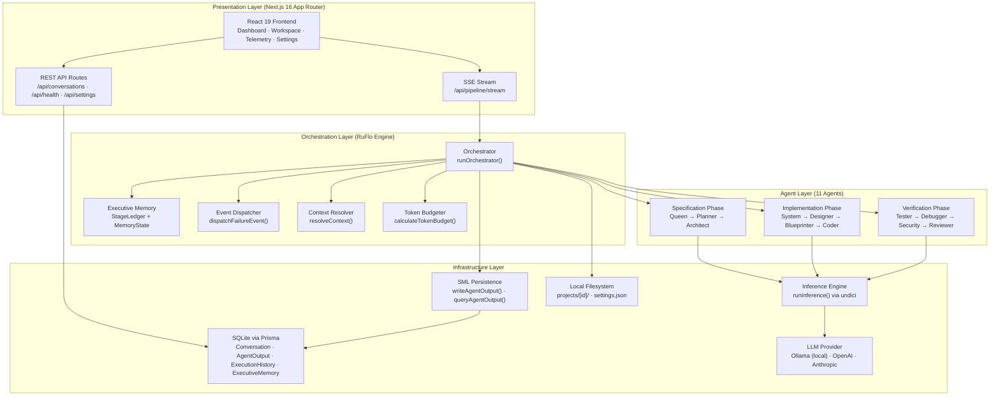
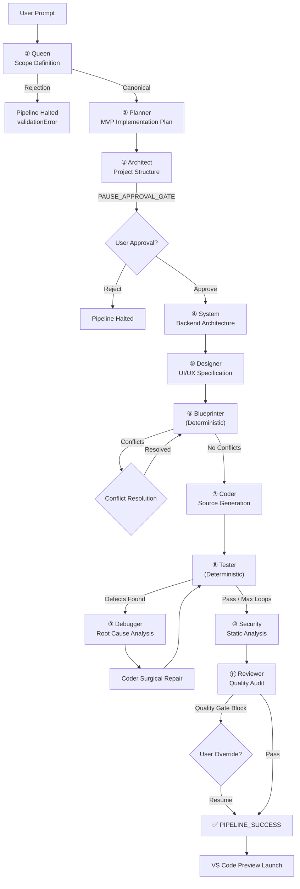
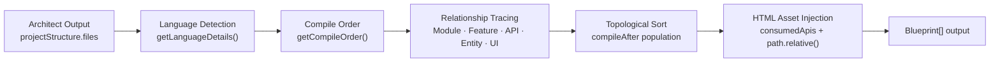
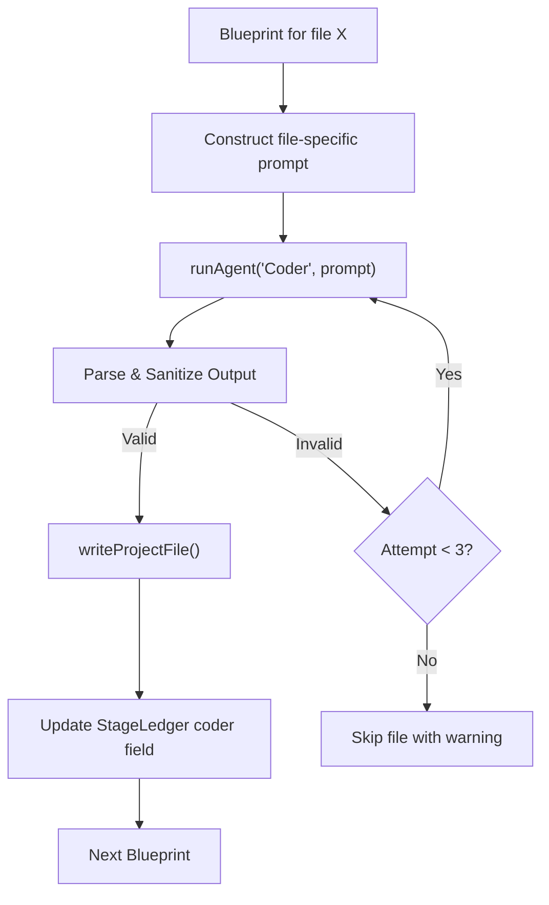
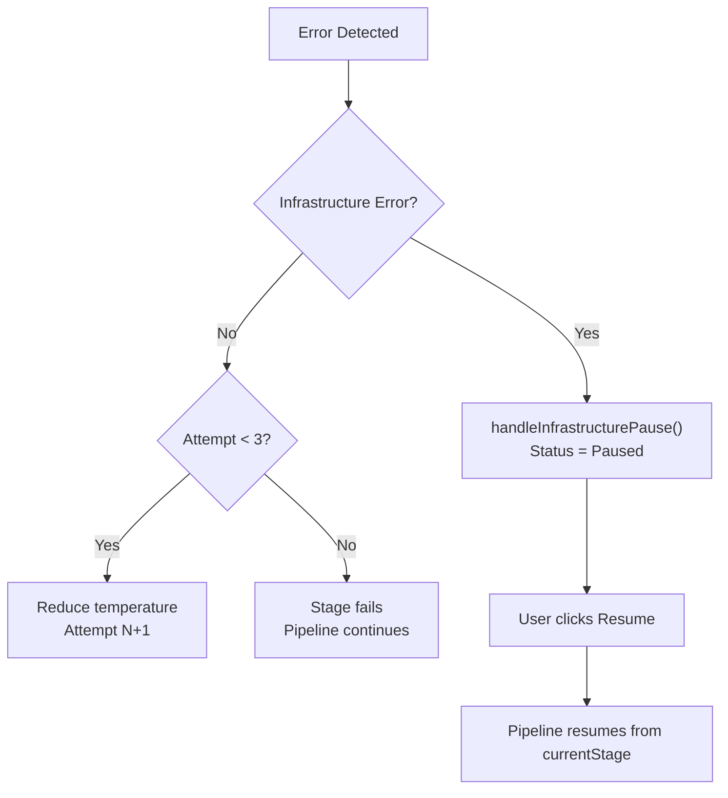

# Autocoder — Technical Implementation Document

> **Version**: Current Implementation (as of 2026-07-26)
> **Codebase**: `Gautam-Mathur/autocoder-redone-`
> **Engine**: RuFlo Multi-Agent Specification Compiler v2.0-stable

---

## Table of Contents

1. [Current Architecture Overview](#1-current-architecture-overview)
2. [Complete Execution Pipeline](#2-complete-execution-pipeline)
3. [Orchestration Workflow](#3-orchestration-workflow)
4. [Agent Registry](#4-agent-registry)
5. [Deterministic Services](#5-deterministic-services)
6. [Event-Driven Specialists](#6-event-driven-specialists)
7. [Executive Memory](#7-executive-memory)
8. [Content Assistant](#8-content-assistant)
9. [Blueprint Engine](#9-blueprint-engine)
10. [Code Synthesizer](#10-code-synthesizer)
11. [Validation Pipeline](#11-validation-pipeline)
12. [Event Dispatcher](#12-event-dispatcher)
13. [Project Contracts and JSON Schemas](#13-project-contracts-and-json-schemas)
14. [Tooling Architecture](#14-tooling-architecture)
15. [Folder Structure](#15-folder-structure)
16. [Technology Stack](#16-technology-stack)

---

## 1. Current Architecture Overview

Autocoder is a **Next.js 16 full-stack application** that transforms natural language prompts into complete, compilable software projects through a deterministic multi-agent pipeline called **RuFlo**. The system operates as a local-first IDE with an embedded LLM inference engine.

### Architectural Layers



### Core Design Principles

| Principle | Implementation |
|-----------|---------------|
| **Strict Ownership** | Each agent writes to exactly one field in `MemoryState`. Cross-field mutation throws `DriftEvent` errors. |
| **Immutable Upstream Context** | Agents read predecessors' outputs but cannot modify them. The `OWNERSHIP` map enforces this at write time. |
| **Oscillation Prevention** | MD5 hashing of coder output detects infinite repair loops where files revert to previous states. |
| **Schema-First Contracts** | Every agent has a mandatory JSON output schema. Outputs are validated before persistence. |
| **Deterministic Resumability** | Pipeline state is persisted to SQLite after every agent completion. Crashed pipelines resume from `currentStage`. |
| **Infrastructure Awareness** | `isInfrastructureError()` detects LLM provider crashes and pauses the pipeline instead of consuming retry budget. |

---

## 2. Complete Execution Pipeline

The pipeline executes 11 stages in strict sequential order. Each stage either invokes an LLM agent or runs a deterministic service.



### Stage Execution Summary

| # | Stage | Type | LLM Calls | Max Retries | Writes To | Pause Gates |
|---|-------|------|-----------|-------------|-----------|-------------|
| 1 | Queen | LLM Agent | 1 | 3 | `taskSpec` | Rejection, Clarification |
| 2 | Planner | LLM Agent | 1 | 3 | `planner` | — |
| 3 | Architect | LLM Agent | 1 | 3 | `architect` | `PAUSE_APPROVAL_GATE` |
| 4 | System | LLM Agent | 1 | 3 | `system` | — |
| 5 | Designer | LLM Agent | 1 | 3 | `designer` | — |
| 6 | Blueprinter | Deterministic | 0 | — | SML only | `PAUSE_CONFLICT` |
| 7 | Coder | LLM Agent | N files × 3 | 3 per file | `coder` | — |
| 8 | Tester | Deterministic | 0 | — | `tester` | — |
| 9 | Debugger | LLM Agent | 1–3 | 3 | `debugger` | Infrastructure Pause |
| 10 | Security | LLM Agent (Map-Reduce) | N files × 3 | 3 per file | `security` | — |
| 11 | Reviewer | LLM Agent (Map-Reduce) | N files × 3 | 3 per file | `reviewer` | Quality Gate Block |

---

## 3. Orchestration Workflow

### Entry Point

```typescript
export async function runOrchestrator(
  conversationId: string,
  userPrompt: string,
  onEvent: PipelineEventCallback,
  signal?: AbortSignal
): Promise<void>
```

### Initialization Sequence

1. **Concurrency Guard**: Checks `activePipelines.has(conversationId)`. Prevents duplicate pipeline runs for the same conversation.
2. **Memory Load**: `loadExecutiveMemory(conversationId)` retrieves persisted state from SQLite. Wraps in `StageLedger` instance.
3. **Prompt Persistence**: Stores `userPrompt` in `memoryState.originalPrompt`. On `'continue'` prompts, reads the original prompt from memory.
4. **Completion Check**: If `conversation.status === 'Completed'`, launches VS Code preview and returns immediately.
5. **Resume Index**: Calculates starting stage index from `conversation.currentStage` to enable mid-pipeline resumption.

### Stage Loop

```typescript
const STAGES = ['Queen', 'Planner', 'Architect', 'System', 'Designer',
                'Blueprinter', 'Coder', 'Tester', 'Debugger', 'Security', 'Reviewer'];

for (let i = startIndex; i < STAGES.length; i++) {
  const stage = STAGES[i];
  // Update currentStage in DB
  await prisma.conversation.update({ where: { id: conversationId }, data: { currentStage: stage } });
  // Emit AGENT_START event
  onEvent({ type: 'AGENT_START', agent: stage });
  // Execute stage-specific logic...
  // Emit AGENT_COMPLETE event
  onEvent({ type: 'AGENT_COMPLETE', agent: stage, output: result });
}
```

### Infrastructure Error Handling

Three error signatures trigger automatic pipeline pause instead of retry budget consumption:

```typescript
const INFRA_ERROR_SIGNATURES = [
  'ollama is not running',
  'connect econnrefused',
  'enotfound',
] as const;
```

When detected, `handleInfrastructurePause()`:
1. Emits `PIPELINE_ERROR` event with infrastructure failure message.
2. Sets conversation status to `'Paused'` in database.
3. Writes failure to `ExecutionHistory`.
4. Returns immediately (does not throw — preserves pipeline state for resume).

### Pipeline Completion

On successful completion of all 11 stages:
1. Updates conversation status to `'Completed'`.
2. Calls `launchVSCodePreview()` to open the generated project.
3. Emits `PIPELINE_SUCCESS` event.
4. Removes conversation from `activePipelines` set.

---

## 4. Agent Registry

All agents are registered in `AGENT_DEFS` (exported from `agents.ts`) and share the `AgentDef` interface:

```typescript
export interface AgentDef {
  name: string;
  temperature: number;
  maxTokens: number;
  systemPrompt: string;
  schema: any;            // JSON Schema for output validation
  getContext: (ledger: any) => Promise<string>;  // Upstream context builder
}
```

---

### 4.1 Queen Agent

| Property | Value |
|----------|-------|
| **File** | `registry/Queen.ts` |
| **Temperature** | `0.2` |
| **Max Tokens** | `1024` |
| **Reads From** | Nothing (first agent) |
| **Writes To** | `taskSpec` |

**Responsibilities**: Evaluates user prompt. Defines MVP scope, constraints, risks, and per-agent downstream instructions. Operates under a "Permissive by Default" philosophy — rejects only blank or non-software prompts.

**Authority**: Full authority over project scope definition. Its output is canonical and immutable downstream.

**Output Schema**:
```json
{
  "anyOf": [
    {
      "contextType": "canonical",
      "mvpId": "string",
      "projectName": "string",
      "problemStatement": "string",
      "projectDescription": "string",
      "projectGoal": "string",
      "mvpScope": { "included": ["string"], "excluded": ["string"] },
      "constraints": ["string"],
      "risks": ["string"],
      "agentInstructions": { "planner": "string", "architect": "string", ... }
    },
    {
      "contextType": "validationError",
      "status": "Rejected",
      "reason": "string",
      "message": "string"
    }
  ]
}
```

**Special Behavior**: Before Queen executes, the orchestrator runs `classifyIsSoftwareRequest()` — a lightweight LLM pre-flight check (temperature `0.1`, max `150` tokens, timeout `30s`) that filters non-software requests. If classified as non-software, the pipeline halts immediately without consuming Queen's token budget.

---

### 4.2 Planner Agent

| Property | Value |
|----------|-------|
| **File** | `registry/Planner.ts` |
| **Temperature** | `0.3` |
| **Max Tokens** | `1536` |
| **Reads From** | Queen: `projectName`, `problemStatement`, `projectDescription`, `projectGoal`, `mvpScope`, `constraints`, `risks`, `agentInstructions` |
| **Writes To** | `planner` |

**Responsibilities**: Transforms Queen's scope into an actionable implementation plan: recommended tech stack, feature list with priorities, functional/non-functional requirements, deliverables, and per-agent instructions.

**Authority**: Decides technology stack, feature prioritization, and requirement granularity. Zero authority over project scope (that's Queen's domain).

**Output Schema**:
```json
{
  "contextType": "canonical",
  "projectName": "string",
  "mvpReference": "string",
  "recommendedTechStack": {
    "frontend": "string", "backend": "string", "database": "string",
    "authentication": "string", "deployment": "string",
    "additionalTechnologies": ["string"]
  },
  "features": [{ "id": "string", "name": "string", "description": "string", "priority": "Critical|High|Medium|Low" }],
  "functionalRequirements": ["string"],
  "nonFunctionalRequirements": { "security": [], "performance": [], "scalability": [], "usability": [], "maintainability": [], "accessibility": [], "reliability": [] },
  "deliverables": ["string"],
  "agentInstructions": { "architect": "string", "system": "string", ... }
}
```

---

### 4.3 Architect Agent

| Property | Value |
|----------|-------|
| **File** | `registry/Architect.ts` |
| **Temperature** | `0.2` |
| **Max Tokens** | `2048` |
| **Reads From** | Planner: `features`, `functionalRequirements`, `nonFunctionalRequirements`, `recommendedTechStack`; Queen: `constraints` |
| **Writes To** | `architect` |

**Responsibilities**: Designs project file/directory structure, module decomposition, inter-module dependencies, shared resources, and coding conventions.

**Authority**: Full authority over file organization and module boundaries. Must respect Planner's tech stack.

**Output Schema**:
```json
{
  "contextType": "canonical",
  "projectName": "string",
  "architectureStyle": "string",
  "projectStructure": {
    "root": "string",
    "directories": ["string"],
    "files": [{ "path": "string", "module": "string" }]
  },
  "modules": [{ "id": "string", "name": "string", "purpose": "string", "supportsFeatures": [], "files": [], "dependsOn": [], "usedBy": [] }],
  "sharedResources": { "configuration": [], "constants": [], "types": [], "utilities": [], "middleware": [], "assets": [], "environment": [], "others": [] },
  "projectConventions": { "namingConvention": "string", "folderConvention": "string", "codingConvention": "string", "importConvention": "string" }
}
```

**Adaptive Rules**:
- *Scripts/CLI*: Flat single-file layout.
- *Buildless Web Apps*: Must create root `index.html` in module `"frontend-entry"`. No `.jsx`/`.tsx` files.
- *Bundled Web Apps*: Standard framework structure (`src/`, `components/`).

---

### 4.4 System Agent

| Property | Value |
|----------|-------|
| **File** | `registry/System.ts` |
| **Temperature** | `0.2` |
| **Max Tokens** | `2048` |
| **Reads From** | Planner (all), Architect (`modules`), Queen (`constraints`) |
| **Writes To** | `system` |

**Responsibilities**: Specifies backend system architecture: database entities with fields/relationships, API endpoints with request/response schemas, routing structure, middleware, services, configuration, and backend business/validation/security rules.

**Output Schema**:
```json
{
  "contextType": "canonical",
  "database": { "type": "string", "entities": [{ "id": "string", "name": "string", "fields": [], "relationships": [], "indexes": [], "constraints": [] }] },
  "apis": [{ "id": "string", "method": "string", "route": "string", "purpose": "string", "request": {}, "response": {}, "middleware": [] }],
  "routing": { "routerStructure": [], "routeGroups": [] },
  "middleware": [{ "name": "string", "purpose": "string", "appliesTo": [] }],
  "services": [{ "id": "string", "name": "string", "purpose": "string", "usedByApis": [] }],
  "configuration": { "environmentVariables": [], "storage": [], "cache": [], "externalServices": [], "authentication": [], "authorization": [] },
  "backendRules": { "validationRules": [], "businessRules": [], "errorHandling": [], "securityPolicies": [] }
}
```

---

### 4.5 Designer Agent

| Property | Value |
|----------|-------|
| **File** | `registry/Designer.ts` |
| **Temperature** | `0.3` |
| **Max Tokens** | `2048` |
| **Reads From** | Planner (all), Architect (`modules`, `projectStructure`), System (`database`) |
| **Writes To** | `designer` |

**Responsibilities**: Generates UI/UX specification: design philosophy, navigation flows, page layouts, reusable component definitions, design system tokens (colors, typography, spacing, animations, breakpoints), accessibility standards, and interaction guidelines.

**Output Schema**:
```json
{
  "contextType": "canonical",
  "designPhilosophy": { "theme": "string", "designPrinciples": [], "targetExperience": "string" },
  "navigation": { "primaryNavigation": [], "secondaryNavigation": [], "userFlows": [] },
  "pages": [{ "id": "string", "name": "string", "purpose": "string", "layout": "string", "supportsFeature": "string", "components": [] }],
  "components": [{ "id": "string", "name": "string", "purpose": "string", "pageId": "string", "variants": [], "states": [] }],
  "designSystem": { "colors": [], "typography": [], "spacing": [], "icons": [], "animations": [], "responsiveBreakpoints": [], "elevation": [], "borders": [] },
  "accessibility": { "standards": [], "requirements": [] },
  "interactionGuidelines": { "feedback": [], "transitions": [], "errorStates": [], "loadingStates": [] }
}
```

---

### 4.6 Coder Agent

| Property | Value |
|----------|-------|
| **File** | `registry/Coder.ts` |
| **Temperature** | `0.1` |
| **Max Tokens** | `4096` |
| **Reads From** | Planner, Architect, System, Designer, and existing `coder` state (for incremental generation) |
| **Writes To** | `coder` |

**Responsibilities**: Implements complete, production-ready source code for each file specified by the Blueprinter. Zero architectural authority — must follow all upstream specifications exactly.

**Output Schema**:
```json
{ "file": "string", "code": "string" }
```

**Special Behavior**:
- Output is raw code inside markdown code blocks (no conversational text).
- Mandatory comment syntax rules per file type.
- Buildless web apps must use inline Babel `<script type="text/babel">`, Tailwind CDN, and state-based routing.
- **Placeholder Guards**: Rejects outputs where >50% of lines are `TODO`/`FIXME` comments or single bracket placeholders like `[code here]`.
- **Syntax Guards**: Validates presence of script syntax characters (`{ } ; =`) for code files with >25 words.

---

### 4.7 Tester Agent

| Property | Value |
|----------|-------|
| **File** | `registry/Tester.ts` |
| **Temperature** | `0.2` |
| **Max Tokens** | `2048` |
| **Reads From** | Queen, Planner, Architect, System, Designer, Coder |
| **Writes To** | `tester` |

**Responsibilities**: Generates automated test file definitions, analyzes dynamic execution logs, registers defects (`DEF-XXX`), and measures feature coverage. Zero code implementation authority.

**Output Schema**:
```json
{
  "contextType": "canonical",
  "generatedTestFiles": [{ "id": "string", "path": "string", "targetFile": "string", "coversFeature": "string", "type": "string", "language": "string", "content": "string" }],
  "testReport": {
    "summary": { "totalTests": 0, "passed": 0, "failed": 0, "skipped": 0, "coverage": "string", "coveredFeatures": [], "missingFeatures": [] },
    "defects": [{ "id": "string", "severity": "Critical|High|Medium|Low", "category": "string", "file": "string", "description": "string", "expectedBehaviour": "string", "actualBehaviour": "string", "reproductionSteps": [] }],
    "warnings": [],
    "status": "Success|Partial|Failed"
  }
}
```

---

### 4.8 Debugger Agent

| Property | Value |
|----------|-------|
| **File** | `registry/Debugger.ts` |
| **Temperature** | `0.2` |
| **Max Tokens** | `1536` |
| **Reads From** | Queen, Planner, Architect, System, Designer, Tester (`testReport`), Coder (`generatedCode`) |
| **Writes To** | `debugger` |

**Responsibilities**: Diagnoses root causes of defects reported by Tester. Produces non-code `implementationInstructions` for the Coder's surgical repair pass. Zero architectural authority.

**Output Schema**:
```json
{
  "contextType": "canonical",
  "debugReport": {
    "issues": [{
      "id": "string", "testerDefectId": "string",
      "severity": "Critical|High|Medium|Low",
      "category": "Compilation|Runtime|Functional|Integration|API|UI|Security|Performance",
      "file": "string", "rootCause": "string",
      "implementationInstructions": ["string"],
      "regressionRisk": "Low|Medium|High"
    }],
    "summary": { "issuesDetected": 0, "issuesResolved": 0, "remainingIssues": 0 },
    "warnings": [], "status": "Success|Partial|Failed"
  }
}
```

---

### 4.9 Security Agent

| Property | Value |
|----------|-------|
| **File** | `registry/Security.ts` |
| **Temperature** | `0.2` |
| **Max Tokens** | `2048` |
| **Reads From** | Queen, Planner, Architect, System, Designer, Coder |
| **Writes To** | `security` |

**Responsibilities**: Performs static security assessment on generated source code. Identifies vulnerabilities, insecure patterns, OWASP Top 10 categories, and CWE references. Zero code modification authority.

**Output Schema**:
```json
{
  "contextType": "canonical",
  "securityReport": {
    "issues": [{
      "id": "string", "severity": "Critical|High|Medium|Low|Informational",
      "category": "Authentication|Authorization|Input Validation|Injection|XSS|CSRF|...",
      "file": "string", "description": "string", "risk": "string", "recommendation": "string",
      "owaspTop10": "string", "cweReference": "string", "confidence": "High|Medium|Low"
    }],
    "summary": { "critical": 0, "high": 0, "medium": 0, "low": 0, "informational": 0 },
    "warnings": [], "status": "Success|Partial|Failed"
  }
}
```

---

### 4.10 Reviewer Agent

| Property | Value |
|----------|-------|
| **File** | `registry/Reviewer.ts` |
| **Temperature** | `0.2` |
| **Max Tokens** | `1536` |
| **Reads From** | Queen, Security, Coder, Debugger |
| **Writes To** | `reviewer` |

**Responsibilities**: Calculates overall project quality score (0–100) and compiles structured code annotations with severity levels.

**Output Schema**:
```json
{
  "qualityScore": 85,
  "annotations": [{
    "file": "string",
    "note": "string",
    "agent": "Reviewer",
    "severity": "info|warn|error"
  }]
}
```

---

## 5. Deterministic Services

### 5.1 Blueprinter Service

| Property | Value |
|----------|-------|
| **File** | `registry/Blueprinter.ts` |
| **Type** | Fully deterministic (no LLM) |
| **Function** | `runDeterministic(ledger: StageLedger): Promise<any>` |
| **Reads From** | `planner`, `architect`, `system`, `designer` (directly from StageLedger) |

**Responsibilities**: Transforms the Architect's file list into a structured compilation manifest. Assigns compile order, resolves inter-file dependencies, traces feature/module ownership, and injects HTML asset linking requirements.

**Internal Workflow**:

1. **File Iteration**: Iterates over `architect.projectStructure.files`.
2. **Language Detection**: `getLanguageDetails(filepath)` maps extensions to language profiles (`.html` → `HTML`, `.js` → `JavaScript`, `.css` → `CSS`, `.ts` → `TypeScript`, `.py` → `Python`, etc.).
3. **Compile Order Assignment**: `getCompileOrder(filepath)`:
   - `999`: HTML entry points (`index.html`, `main.html`, `app.html`)
   - `1`: Config / constants / types / db files
   - `2`: Entity / model / schema files
   - `3`: Service / util / helper files
   - `4`: Controller / route / api files
   - `5`: UI components / page / view files
   - `6`: General entry points / scripts
4. **Relationship Tracing**: For each file, resolves owning module, supported features (`featureIds`), matching Planner requirement IDs, implemented APIs, DB entities, and Designer page/component IDs.
5. **Topological Sort**: Populates `compileAfter` array with IDs of all blueprints having strictly lower `compileOrder`.
6. **HTML Asset Injection**: For blueprints matching `HTML_ENTRY_PATTERN`, computes `path.relative()` paths to JS and CSS sibling files and injects `REQUIRED: Include <script src="...">` and `REQUIRED: Include <link rel="stylesheet" href="...">` directives into `consumedApis`.

**Output**: `{ blueprints: Blueprint[] }` — See [Section 13](#13-project-contracts-and-json-schemas) for full schema.

---

### 5.2 Context Resolver Service

| Property | Value |
|----------|-------|
| **File** | `ruflo/contextResolver.ts` |
| **Function** | `resolveContext(conversationId, ledger): Promise<ContextPack>` |

**Responsibilities**: Cross-validates outputs from Queen, Planner, Architect, System, and Designer to detect architectural misalignments before code generation.

**Conflict Detection Rules**:

| Rule | Condition | Resolution |
|------|-----------|------------|
| **Database Constraint vs Schema** | Constraints contain `"no database"` / `"local storage only"` but System generated DB entities | Recommend mapping to client-side storage |
| **Tech Stack Conflict** | Planner specifies Python stack but Architect lists `.js`/`.ts` files | Recommend file extension conversion |
| **Missing API Endpoint** | Designer components reference `fetch from /api/...` not declared in System APIs | Recommend registering mock handler |

When conflicts are detected, the orchestrator emits `PAUSE_CONFLICT` and presents resolution options to the user.

---

## 6. Event-Driven Specialists

### 6.1 Failure Triage Router

| Property | Value |
|----------|-------|
| **File** | `ruflo/eventDispatcher.ts` |
| **Function** | `dispatchFailureEvent(logs, stage): TriageResult` |

**Trigger Condition**: Called by the Tester stage when defects are found, or when any agent stage produces errors.

**Routing Logic** (pattern-matched against normalized log content):

| Failure Type | Match Patterns | Routed To |
|--------------|----------------|-----------|
| `conflict` | `specificationconflict`, `conflict detected`, `mismatched` | `ConflictResolver` |
| `syntax` | `syntaxerror`, `unexpected token`, `unbalanced brackets` | `Debugger` |
| `compilation` | `tsc error`, `cannot find name`, `property does not exist` | `Debugger` |
| `performance` | `slow query`, `out of memory`, `large bundle` | `OptimizationRefiner` |
| `quality` | `eslint`, `lint error`, `unused variable`, `deprecated` | `RefactoringAdvisor` |
| `test_failure` | *(default fallback)* | `Debugger` |

**Output**:
```typescript
interface TriageResult {
  failureType: FailureType;
  specialistAgent: string;
  reproducibleLogs: string;
  contextHint: string;
}
```

---

## 7. Executive Memory

### 7.1 Schema

```typescript
interface MemoryState {
  originalPrompt?: string;

  // Specification Phase
  taskSpec: any | null;       // Queen output
  planner: any | null;        // Planner output
  architect: any | null;      // Architect output

  // Implementation Phase
  system: any | null;         // System output
  designer: any | null;       // Designer output
  coder: Record<string, any>; // filepath → code content map

  // Verification Phase
  debugger: any | null;
  security: any | null;
  reviewer: any | null;
  tester: any | null;

  // Metadata
  invalidated: string[];              // Stages needing re-run
  hashes: Record<string, string>;     // filepath → MD5 hash
  decisions: any[];                   // Historical decision log
  qualityGateOverride?: boolean;      // Reviewer quality gate bypass flag
}
```

### 7.2 Storage Model

- **Database Table**: `ExecutiveMemory` (Prisma model)
- **Serialization**: `JSON.stringify(state)` → single `state` text column
- **Keying**: One record per `conversationId` (`@unique` constraint)
- **Persistence**: Upsert on every `StageLedger.write()`, `invalidate()`, `clearInvalidation()`, and `logDecision()` call

### 7.3 Ownership Model

The `OWNERSHIP` frozen object enforces strict single-field mutation access:

```typescript
const OWNERSHIP = Object.freeze({
  Queen:     ['taskSpec'],
  Planner:   ['planner'],
  Architect: ['architect'],
  System:    ['system'],
  Designer:  ['designer'],
  Coder:     ['coder'],
  Debugger:  ['debugger'],
  Security:  ['security'],
  Reviewer:  ['reviewer'],
  Tester:    ['tester'],
});
```

Any agent attempting to write to a field it does not own triggers:
```
DriftEvent: Agent "Debugger" is not allowed to directly mutate field "coder". Allowed: ["debugger"]
```

### 7.4 Query System

```typescript
// Direct field read
ledger.read('taskSpec')  // Returns Queen's full output

// Scoped query (isolates specific keys from another agent's output)
ledger.query('Coder', { fromAgent: 'Planner', select: ['features', 'functionalRequirements'] })
```

### 7.5 Read/Write Permissions

| Operation | Access Level | Enforcement |
|-----------|-------------|-------------|
| `read(field)` | Any agent can read any field | No restriction |
| `query(agent, params)` | Any agent can query any other agent's output | Filtered by `select` keys |
| `write(agent, field, value)` | Only the owning agent can write | `OWNERSHIP` map check → `DriftEvent` error on violation |
| `invalidate(agents)` | Orchestrator only | Adds to `invalidated[]` |
| `clearInvalidation(agent)` | Orchestrator only | Removes from `invalidated[]` |

### 7.6 Versioning (Oscillation Detection)

When `field === 'coder'`, the `write()` method implements oscillation detection:

1. For each file in the coder output, compute MD5 hash of content.
2. If hash matches current `state.hashes[filepath]`, skip (no change).
3. Check `fileStateHistory[filepath]` — an in-memory array of all previous MD5 hashes for that file.
4. If the new hash appears in history, **throw `Error("Oscillation detected")`** — the file has reverted to a previous state, indicating an infinite repair loop.
5. Otherwise, append hash to history and update `state.hashes`.

---

## 8. Content Assistant

### 8.1 Prompt Prompt Construction

The Content Assistant system (`contextBuilder.ts`, agent `getContext()` functions, and `manifest.json`) assembles the complete prompt context for each agent before LLM invocation.

### 8.2 Context Builder

```typescript
// contextBuilder.ts
export function buildUserContext(ledger: StageLedger, agentName: string): string {
  const agentDef = AGENT_DEFS[agentName];
  return agentDef.getContext(ledger);  // Returns JSON stringified upstream context
}
```

Each agent's `getContext(ledger)` method selectively reads upstream outputs from the `StageLedger` and assembles them into a JSON string. For example, the Planner reads Queen's `projectName`, `problemStatement`, `mvpScope`, `constraints`, etc.

### 8.3 Reference Mapping

The `manifest.json` file defines the formal dependency graph between agents:

```json
{
  "Planner": {
    "inputs": {
      "Queen": ["projectName", "problemStatement", "projectDescription", "projectGoal", "mvpScope", "constraints", "risks", "agentInstructions"]
    }
  },
  "Architect": {
    "inputs": {
      "Planner": ["features", "functionalRequirements", "nonFunctionalRequirements", "recommendedTechStack"],
      "Queen": ["constraints"]
    }
  }
}
```

### 8.4 Dependency Injection

The orchestrator's `runAgent()` function assembles the full prompt:

1. **System Instructions** = `agentDef.systemPrompt` + JSON constraints block + schema block + retry hint
2. **User Content** = `buildUserContext(ledger, agentName)` + `userPromptText`

For the Coder agent specifically, the user content is constructed per-blueprint with file-specific instructions (imports, exports, interfaces, classes, functions, APIs, consumed APIs, acceptance criteria).

### 8.5 Prompt Assembly

```typescript
// System prompt structure
systemInstructions = [
  agentDef.systemPrompt,                           // Role definition + rules
  "\n\nActive Model Constraints:\n",
  "- Output MUST be valid, parseable JSON...",       // JSON format enforcement
  "\n\nOutput Schema (MUST return valid JSON):\n",
  JSON.stringify(agentDef.schema, null, 2),          // Exact expected schema
  retryHint                                          // (attempts > 1 only)
].join('');

// User content structure
userContent = [
  "Upstream Context:\n",
  JSON.stringify(upstreamContext),                    // Previous agents' outputs
  "\n\nOriginal Instruction:\n",
  userPrompt                                          // User's original request
].join('');
```

---

## 9. Blueprint Engine

### 9.1 Workflow



### 9.2 File Graph Generation

For each file in `architect.projectStructure.files`:
- Maps to owning module via `architect.modules`
- Resolves `featureIds` from module's `supportsFeatures`
- Maps to Planner requirement IDs by keyword matching
- Maps to System API IDs and DB entity IDs by route/entity name matching
- Maps to Designer page/component IDs by name matching

### 9.3 Dependency Graph Generation

The `compileAfter` array creates a directed acyclic graph:
```
Config files (order 1)
  └─→ Entity/Model files (order 2)
       └─→ Service/Util files (order 3)
            └─→ Controller/Route files (order 4)
                 └─→ UI Component files (order 5)
                      └─→ General scripts (order 6)
                           └─→ HTML entry points (order 999)
```

### 9.4 Generation Ordering

Blueprints are sorted by `compileOrder` ascending at Coder stage entry. This ensures:
1. Configuration and type definitions are generated first.
2. Services and utilities are generated before controllers that import them.
3. HTML entry points are generated last, after all JS/CSS assets exist.

---

## 10. Code Synthesizer

### 10.1 Generation Strategy

The Coder agent operates in a **file-by-file sequential loop**. For each blueprint:
1. Construct file-specific prompt with all blueprint metadata (imports, exports, interfaces, classes, functions, APIs, constraints).
2. Include previously generated code from sibling files as context.
3. Invoke LLM with up to 3 retry attempts.
4. Validate and sanitize output.
5. Write to disk and update `StageLedger`.

### 10.2 File Generation Workflow



### 10.3 Dependency Handling

The Coder prompt for each file includes:
- **Previously generated code**: All files already compiled in this run (from `ledger.read('coder')`)
- **Blueprint dependencies**: `compileAfter` references, `imports`, `consumedApis`
- **Strict instruction**: "You MUST write code that is compatible with already-generated files"

### 10.4 Incremental Generation

During surgical repair (Debugger → Coder loop), the Coder receives:
- The current file's complete source code
- The specific defect description and root cause analysis
- Implementation instructions from the Debugger
- Strict rule: "Fix ONLY the reported issue. Do NOT restructure the entire file."

---

## 11. Validation Pipeline

The Tester stage executes a **hybrid validation pipeline** combining deterministic static checks with LLM-generated test analysis.

### 11.1 File System & Syntax Check (Build)

- **Recursive file scan**: Traverses all `.js`, `.jsx`, `.ts`, `.tsx` files in `projects/[id]/`.
- **Stack-based brace balance**: Checks `{}`, `()`, `[]` balance to detect syntax errors.
- **Import reference validation**: Checks that relative `import` paths reference files that exist on disk.

### 11.2 HTML-JS Integration Check (Type Checking)

For **vanilla projects** only (no `package.json`):
- Recursively finds all `.html` and `.js` files.
- For each HTML × JS pair, computes `path.relative()` and checks for `<script src="...">` tags matching either the relative path or basename.
- Missing links generate `DEF-INTEGRATION` defects.

### 11.3 Runtime Validation

- Spawns `node ${entryFile}` on port `8082` with a 4-second timeout.
- Captures `stderr` output.
- Crashes or exceptions in stderr generate `DEF-RUNTIME` defects.

### 11.4 Constraint Compliance Testing

Reads `taskSpec.constraints` from Queen's output. Matches constraint keywords against a `CONSTRAINT_API_MAP`:

| Constraint Keywords | Scanned Patterns | Label |
|---------------------|-----------------|-------|
| `localstorage`, `browser storage`, `offline storage` | `localStorage.*`, `localForage`, `store.(set\|get)`, `lowdb`, `chrome.storage` | localStorage / Client Persistence API |
| `indexeddb` | `indexedDB`, `IDBFactory`, `window.indexedDB` | IndexedDB API |
| `websocket`, `real-time` | `new WebSocket(`, `.addEventListener('message'` | WebSocket Connection |
| `fetch api`, `rest api`, `http request` | `fetch(`, `axios.`, `XMLHttpRequest` | Fetch/AJAX Client |

Missing implementations generate `DEF-CONSTRAINT` defects.

### 11.5 Security Audit (Static Analysis)

Executed as a **Map-Reduce** pattern across all generated files:
- **Map Phase**: Each file is individually audited by the Security agent.
- **Reduce Phase**: Aggregates all issues and computes severity summary.
- **Static Regex Scan**: Scans for `eval()`, `Function()`, and hardcoded API keys/secrets (`sk-`, `AIzaSy`, `api_key`, `secret` without `process.env`).

### 11.6 Quality Verification (Reviewer Gate)

Executed as a **Map-Reduce** pattern:
- **Map Phase**: Each file is individually reviewed for quality score and annotations.
- **Reduce Phase**: Calculates average quality score.
- **Quality Gate**: If any annotation has `severity: 'error'` AND `qualityGateOverride` is `false`:
  - Sets `qualityGateOverride = true` in memory.
  - Emits `PIPELINE_ERROR` with blocked annotations summary.
  - Pauses pipeline. Next resume bypasses the gate (one-time override).
  - Override flag is immediately cleared on re-entry to prevent stuck state.

---

## 12. Event Dispatcher

### 12.1 Events

All events are emitted via the `onEvent: PipelineEventCallback` function and streamed to the frontend via SSE.

| Event Type | Payload | When Emitted |
|------------|---------|--------------|
| `AGENT_START` | `{ agent: string }` | Stage begins execution |
| `AGENT_STREAM_PROGRESS` | `{ agent, tokenCount, speculative }` | During LLM streaming (real-time) |
| `AGENT_COMPLETE` | `{ agent, output }` | Stage completes successfully |
| `AGENT_LOG` | `{ agent, message }` | Informational log from any stage |
| `AGENT_RICH_TELEMETRY` | `{ telemetryType, inflow, thought, outflow, orchestration }` | After each agent execution (full trace) |
| `PAUSE_APPROVAL_GATE` | `{ message, architecturePreview }` | After Architect stage (awaits user approval) |
| `PAUSE_CLARIFICATION` | `{ questions[], message }` | When Queen determines prompt needs clarification |
| `PAUSE_CONFLICT` | `{ conflicts[], message }` | When Blueprinter detects architectural conflicts |
| `PIPELINE_TRIAGE` | `{ triageResult }` | When Tester finds defects (specialist routing) |
| `PIPELINE_ERROR` | `{ message }` | Infrastructure failure or quality gate block |
| `PIPELINE_SUCCESS` | `{ message }` | All stages completed successfully |

### 12.2 Routing Logic

Events flow through: `Orchestrator` → `onEvent callback` → `SSE Route Handler` → `EventSource (browser)`

The SSE route (`/api/pipeline/stream`) maintains a persistent HTTP connection with `text/event-stream` content type and sends keep-alive pings every 15 seconds.

### 12.3 Recovery Flow



---

## 13. Project Contracts and JSON Schemas

### 13.1 Blueprint Schema

```json
{
  "id": "string (UUID)",
  "file": "string (filepath)",
  "moduleId": "string",
  "featureIds": ["string"],
  "plannerRequirementIds": ["string"],
  "language": "string (e.g., 'JavaScript')",
  "languageProfile": "string (e.g., 'Logic')",
  "purpose": "string",
  "compileOrder": "number (1-999)",
  "compileAfter": ["string (blueprint IDs)"],
  "imports": ["string"],
  "exports": ["string"],
  "dependencies": ["string"],
  "interfaces": ["string"],
  "classes": ["string"],
  "functions": ["string"],
  "implementedApis": ["string (API IDs)"],
  "consumedApis": ["string"],
  "databaseEntities": ["string (entity IDs)"],
  "designerPageId": "string | null",
  "designerComponentIds": ["string"],
  "acceptanceCriteria": ["string"],
  "allowedConstructs": ["string"],
  "forbiddenConstructs": ["string"],
  "validationRules": ["string"]
}
```

### 13.2 Database Models (Prisma)

| Model | Fields | Relations |
|-------|--------|-----------|
| **Conversation** | `id` (UUID PK), `title`, `status`, `currentStage`, `createdAt`, `updatedAt` | → `AgentOutput[]`, `ExecutionHistory[]`, `ExecutiveMemory?` |
| **AgentOutput** | `id` (UUID PK), `conversationId` (FK), `agentName`, `stage`, `schemaVersion`, `model`, `validatedJson`, `executionTime`, `tokenUsage`, `attempt`, `createdAt` | → `AgentIndex[]` |
| **AgentIndex** | `id` (UUID PK), `conversationId`, `outputId` (FK), `path`, `value`, `createdAt` | |
| **ExecutionHistory** | `id` (UUID PK), `conversationId` (FK), `stage`, `status`, `logs`, `createdAt` | |
| **ExecutiveMemory** | `id` (UUID PK), `conversationId` (unique FK), `state` (JSON string), `createdAt`, `updatedAt` | |

All foreign keys cascade on delete.

---

## 14. Tooling Architecture

### 14.1 Internal Tools

| Tool | File | Purpose |
|------|------|---------|
| `runInference()` | `inference.ts` | HTTP streaming call to Ollama/OpenAI/Anthropic with undici |
| `getLLMConfig()` | `inference.ts` | Reads provider config from env + `settings.json` with fallback model detection |
| `validateSchema()` | `orchestrator.ts` | Recursive JSON schema validation with `anyOf` support |
| `writeProjectFile()` | `orchestrator.ts` | Writes generated source files to `projects/[id]/` with directory creation and UTF-8 sanitization |
| `launchVSCodePreview()` | `orchestrator.ts` | Opens generated project in VS Code with auto-run task configuration |
| `checkOllamaConnection()` | `inference.ts` | GET request to Ollama `/api/tags` with 2s timeout |

### 14.2 Query Tools (SML)

| Function | Purpose |
|----------|---------|
| `writeAgentOutput(params)` | Persists agent JSON to `AgentOutput` + auto-indexes top-level keys in `AgentIndex` |
| `queryAgentOutput(conversationId, agentName, path)` | Retrieves latest indexed value for `agentName.path` |
| `getBlueprint(conversationId, file)` | Retrieves Blueprinter output for a specific file |
| `getFeatures()` | Extracts Planner feature list |
| `getModules()` | Extracts Architect module list |
| `getEndpoints()` | Extracts System API endpoints |
| `getSecurityIssues()` | Extracts Security report issues |
| `getQualityAnnotations()` | Extracts Reviewer annotations |

### 14.3 Utility Functions

| Function | Purpose |
|----------|---------|
| `writeHistoryLog()` | Writes execution record to `ExecutionHistory` table |
| `writeRichTelemetryLog()` | Assembles and persists structured telemetry with inflow/thought/outflow/orchestration data |
| `classifyIsSoftwareRequest()` | Lightweight LLM pre-flight to filter non-software prompts |
| `calculateTokenBudget()` | Dynamic token budget based on project complexity |
| `dispatchFailureEvent()` | Pattern-matches failure logs to specialist agents |
| `resolveContext()` | Cross-validates agent outputs for architectural conflicts |
| `buildUserContext()` | Assembles upstream context JSON for agent prompts |

---

## 15. Folder Structure

```
autocoder-redone-/
├── prisma/
│   └── schema.prisma              # Database schema (5 models)
├── public/
│   ├── file.svg, globe.svg        # Static SVG assets
│   ├── next.svg, vercel.svg
│   └── window.svg
├── projects/                       # Generated project output directories
│   └── [conversation-id]/          # One directory per pipeline run
├── src/
│   ├── app/                        # Next.js App Router
│   │   ├── layout.tsx              # Root layout (AppProvider, TopAppBar, Sidebar)
│   │   ├── page.tsx                # Landing dashboard
│   │   ├── globals.css             # Global styles
│   │   ├── api/
│   │   │   ├── conversations/
│   │   │   │   ├── route.ts        # GET (list) / POST (create)
│   │   │   │   ├── clear/route.ts  # POST (delete all)
│   │   │   │   └── [id]/
│   │   │   │       ├── route.ts        # GET (details) / DELETE
│   │   │   │       ├── download/route.ts   # GET (ZIP download)
│   │   │   │       ├── files/route.ts      # GET (file tree)
│   │   │   │       ├── files/read/route.ts # GET (file content)
│   │   │   │       └── telemetry/route.ts  # GET (metrics)
│   │   │   ├── health/
│   │   │   │   ├── route.ts        # GET (Ollama connection + model stats)
│   │   │   │   └── system/route.ts # GET (CPU/RAM metrics)
│   │   │   ├── pipeline/
│   │   │   │   ├── stream/route.ts # GET (SSE event stream)
│   │   │   │   └── resume/route.ts # POST (resume paused pipeline)
│   │   │   └── settings/
│   │   │       └── route.ts        # GET/POST (LLM configuration)
│   │   ├── docs/page.tsx           # Documentation guidebook
│   │   ├── health/page.tsx         # System health monitor
│   │   ├── settings/page.tsx       # LLM settings console
│   │   ├── support/page.tsx        # FAQ & troubleshooting (50 items)
│   │   ├── telemetry/page.tsx      # Execution telemetry dashboard
│   │   └── workspace/
│   │       ├── page.tsx            # Workspace entry (Suspense wrapper)
│   │       └── WorkspaceContent.tsx # Compiler console + multi-tab viewer
│   ├── components/
│   │   ├── Sidebar.tsx             # Navigation drawer
│   │   └── TopAppBar.tsx           # Top bar with model selector + approval gate
│   ├── context/
│   │   └── AppContext.tsx          # Global state provider
│   └── lib/
│       ├── db.ts                   # Prisma client (SQLite + better-sqlite3)
│       └── agents/
│           ├── contextBuilder.ts   # Upstream context assembler
│           ├── inference.ts        # LLM inference engine (Ollama/OpenAI/Anthropic)
│           ├── manifest.json       # Agent dependency graph
│           ├── sml.ts              # Schema Markup Language persistence layer
│           └── ruflo/
│               ├── agents.ts               # AGENT_DEFS registry
│               ├── contextResolver.ts       # Architectural conflict detection
│               ├── eventDispatcher.ts       # Failure triage routing
│               ├── memory.ts               # MemoryState + StageLedger + Ownership
│               ├── orchestrator.ts          # Main pipeline orchestrator (~1900 lines)
│               ├── token-budgeter.ts        # Dynamic token budget calculator
│               └── registry/
│                   ├── Queen.ts         # Scope definition agent
│                   ├── Planner.ts       # Implementation planning agent
│                   ├── Architect.ts     # Project structure agent
│                   ├── System.ts        # Backend architecture agent
│                   ├── Designer.ts      # UI/UX specification agent
│                   ├── Blueprinter.ts   # Deterministic compilation manifest
│                   ├── Coder.ts         # Source code generation agent
│                   ├── Tester.ts        # Test analysis agent
│                   ├── Debugger.ts      # Root cause analysis agent
│                   ├── Security.ts      # Security audit agent
│                   └── Reviewer.ts      # Quality review agent
├── dev.db                          # SQLite database file
├── settings.json                   # LLM provider configuration
├── package.json                    # Dependencies & scripts
├── tsconfig.json                   # TypeScript configuration
└── next.config.ts                  # Next.js configuration
```

---

## 16. Technology Stack

### Runtime & Framework

| Component | Technology | Version |
|-----------|-----------|---------|
| **Runtime** | Node.js | ≥18 (ES2017 target) |
| **Framework** | Next.js (App Router) | `16.2.10` |
| **React** | React | `19.2.4` |
| **Language** | TypeScript | `^5` |

### Database & Storage

| Component | Technology | Details |
|-----------|-----------|---------|
| **Database** | SQLite | Via `better-sqlite3` (`^12.11.1`) |
| **ORM** | Prisma | `^7.8.0` with `@prisma/adapter-better-sqlite3` |
| **File Storage** | Local filesystem | `projects/[id]/` directories |
| **Config Storage** | JSON file | `settings.json` at project root |

### LLM Providers

| Provider | Transport | Default Model |
|----------|-----------|---------------|
| **Ollama** (default) | HTTP via `undici` (`^8.8.0`) | `qwen3-coder:30b` (configurable) |
| **OpenAI** | HTTP | `gpt-4o-mini` |
| **Anthropic** | HTTP | `claude-3-5-sonnet-20241022` |

### Frontend Libraries

| Library | Version | Purpose |
|---------|---------|---------|
| `@monaco-editor/react` | `^4.7.0` | Code editor in workspace |
| `chart.js` | `^4.5.1` | Telemetry charts |
| `react-chartjs-2` | `^5.3.1` | React chart wrapper |
| `lucide-react` | `^1.23.0` | Icon library |
| `tailwindcss` | `^4` | Utility-first CSS |

### Build & Dev Tools

| Tool | Version | Purpose |
|------|---------|---------|
| `eslint` | `^9` | Linting |
| `eslint-config-next` | `16.2.10` | Next.js lint rules |
| `@tailwindcss/postcss` | `^4` | CSS processing |
| `prisma` | `^7.8.0` | DB schema management & migrations |

### HTTP & Networking

| Component | Details |
|-----------|---------|
| **LLM Client** | `undici.fetch` with custom `Agent` dispatcher |
| **Timeouts** | `headersTimeout: 1,800,000ms`, `bodyTimeout: 1,800,000ms`, `keepAliveTimeout: 1,800,000ms` (30 minutes) |
| **Streaming** | Chunked SSE parsing with `TextDecoder` and line splitting |
| **Frontend ↔ Backend** | SSE (`EventSource`) for real-time pipeline events; REST for CRUD operations |
| **Keep-Alive** | SSE heartbeat ping every 15 seconds |
