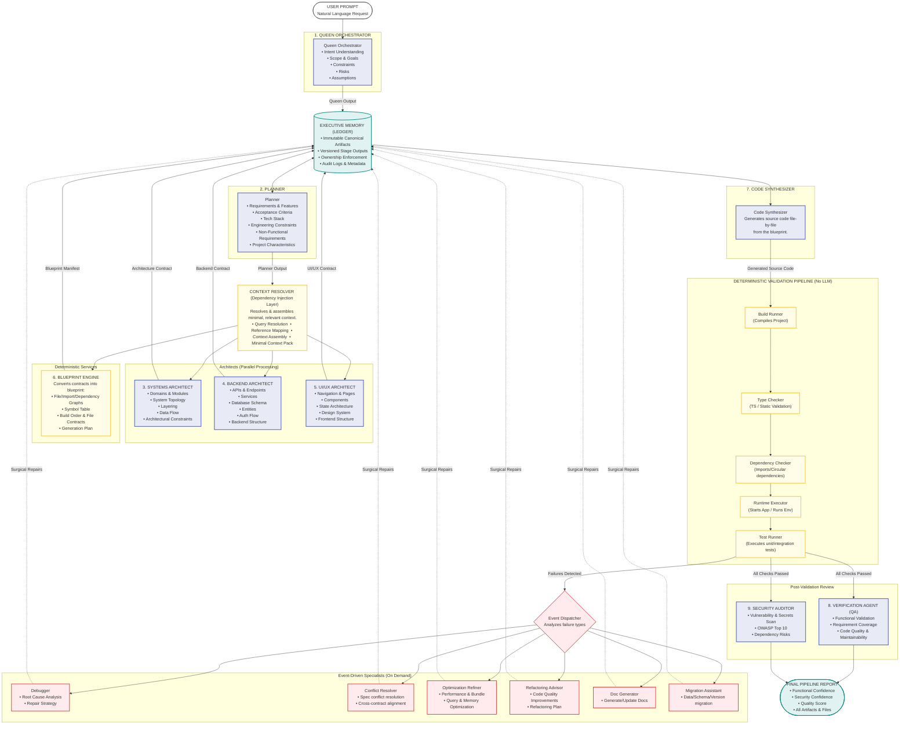

# Multi-Agent Compilation Pipeline Diagram

You can view the rendering of this diagram in any Markdown editor supporting Mermaid, or copy the content of [multi_agent_pipeline.mermaid](file:///home/lenovo/Downloads/autocoder-redone-/multi_agent_pipeline.mermaid) into a Mermaid Live Editor.

